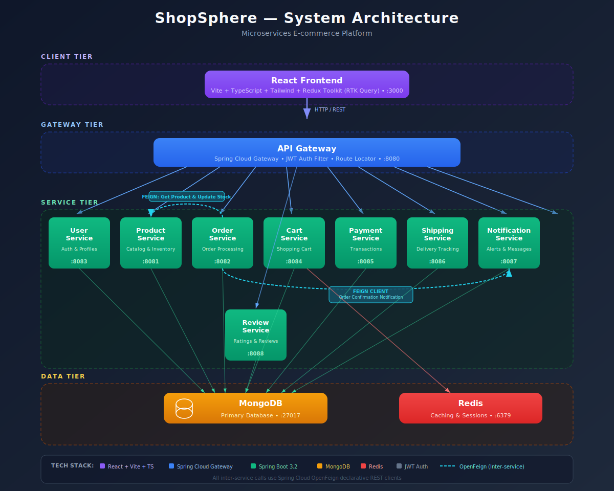

# ShopSphere — E-commerce Microservice Platform

A production-grade e-commerce platform built with microservices architecture using Spring Boot, MongoDB, and a React frontend.

## System Architecture

<p align="center">
  
</p>

The platform follows a **microservices architecture** where each service is independently deployable and owns its domain logic. All client requests flow through the API Gateway, which handles JWT authentication and routes to the appropriate service.

### Services Overview

| Service | Port | Description |
|---------|------|-------------|
| **API Gateway** | 8080 | Routes requests, JWT authentication filter, rate limiting |
| **User Service** | 8083 | User registration, login, profile management, JWT token generation |
| **Product Service** | 8081 | Product catalog, inventory management, search, categories |
| **Order Service** | 8082 | Order creation, status tracking, order history |
| **Cart Service** | 8084 | Shopping cart CRUD, coupon application |
| **Payment Service** | 8085 | Payment processing, transaction records |
| **Shipping Service** | 8086 | Shipment creation, delivery tracking, status updates |
| **Notification Service** | 8087 | In-app notifications and alerts |
| **Review Service** | 8088 | Product reviews, ratings, moderation |
| **React Frontend** | 3000 | Customer storefront and admin dashboard |

## Technology Stack

### Backend
- **Framework**: Spring Boot 3.2.3 (Java 17)
- **API Gateway**: Spring Cloud Gateway
- **Database**: MongoDB
- **Caching**: Redis
- **Authentication**: JWT (JSON Web Tokens)
- **Build Tool**: Maven
- **Mapping**: MapStruct
- **API Docs**: OpenAPI / Swagger

### Frontend
- **Framework**: React 18 + TypeScript
- **Build Tool**: Vite
- **Styling**: Tailwind CSS
- **State Management**: Redux Toolkit (RTK Query)
- **Routing**: React Router v6
- **Icons**: Lucide React

## Prerequisites

- JDK 17
- Maven
- Node.js 18+
- MongoDB
- Redis

## Getting Started

### 1. Start Infrastructure

```bash
# MongoDB
mongod --config /opt/homebrew/etc/mongod.conf  # macOS Apple Silicon
# or
mongod --config /usr/local/etc/mongod.conf     # macOS Intel

# Redis
redis-server
```

### 2. Start Backend Services

Start each service from the project root in separate terminals:

```bash
# API Gateway
cd api-gateway && mvn spring-boot:run

# User Service
cd user-service && mvn spring-boot:run

# Product Service
cd product-service && mvn spring-boot:run

# Order Service
cd order-service && mvn spring-boot:run

# Cart Service
cd cart-service && mvn spring-boot:run

# Payment Service
cd payment-service && mvn spring-boot:run

# Shipping Service
cd shipping-service && mvn spring-boot:run

# Notification Service
cd notification-service && mvn spring-boot:run

# Review Service
cd review-service && mvn spring-boot:run
```

### 3. Start Frontend

```bash
cd frontend
npm install
npm run dev
```

### 4. Access the Application

- **Storefront**: http://localhost:3000
- **API Gateway**: http://localhost:8080

## Project Structure

```
ShopSphere-E-commerce-Microservice-Platform/
├── api-gateway/          # Spring Cloud Gateway + JWT filter
├── user-service/         # Authentication & user management
├── product-service/      # Product catalog & inventory
├── order-service/        # Order processing
├── cart-service/         # Shopping cart
├── payment-service/      # Payment processing
├── shipping-service/     # Shipment & delivery tracking
├── notification-service/ # In-app notifications
├── review-service/       # Reviews & ratings
├── frontend/             # React + Vite + TypeScript
│   └── src/
│       ├── features/     # RTK Query API slices per service
│       ├── pages/
│       │   ├── store/    # Customer-facing pages
│       │   ├── admin/    # Admin dashboard pages
│       │   └── auth/     # Login & registration
│       ├── components/   # Shared UI components
│       └── routes/       # Route definitions & guards
└── docs/                 # Architecture diagrams
```

## Key Features

### Customer Storefront
- Browse product catalog with search and filters
- Product detail pages with images, specs, and reviews
- Shopping cart with quantity management
- Multi-step checkout (shipping → payment → confirmation)
- Order history and tracking
- Write and read product reviews
- In-app notifications

### Admin Dashboard
- Dashboard with order statistics
- Product CRUD management
- Order management and status updates
- User management
- Review moderation (approve/reject)
- Shipment tracking

## Architecture Decisions

1. **Single API Gateway** — All client requests route through Spring Cloud Gateway which handles JWT validation and request routing
2. **Service-per-Domain** — Each microservice owns its domain (users, products, orders, etc.) with its own MongoDB collections
3. **Shared MongoDB Instance** — Services share a MongoDB instance but use separate databases/collections for data isolation
4. **JWT Authentication** — Stateless auth with tokens generated by User Service and validated at the Gateway
5. **RTK Query** — Single Redux API slice with injected endpoints per feature for efficient caching and cache invalidation
6. **Vite Proxy** — Frontend proxies `/api` requests to the gateway during development to avoid CORS issues

## API Endpoints

All endpoints are prefixed with `/api/v1` and accessed through the gateway at port 8080.

| Prefix | Service |
|--------|---------|
| `/api/v1/auth/**` | User Service (login, register) |
| `/api/v1/users/**` | User Service (profiles) |
| `/api/v1/products/**` | Product Service |
| `/api/v1/orders/**` | Order Service |
| `/api/v1/carts/**` | Cart Service |
| `/api/v1/payments/**` | Payment Service |
| `/api/v1/shipments/**` | Shipping Service |
| `/api/v1/notifications/**` | Notification Service |
| `/api/v1/reviews/**` | Review Service |

## License

This project is licensed under the MIT License.
